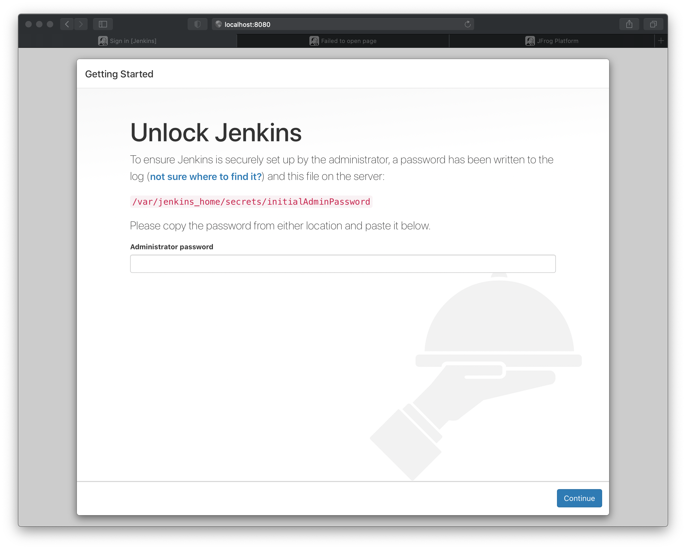
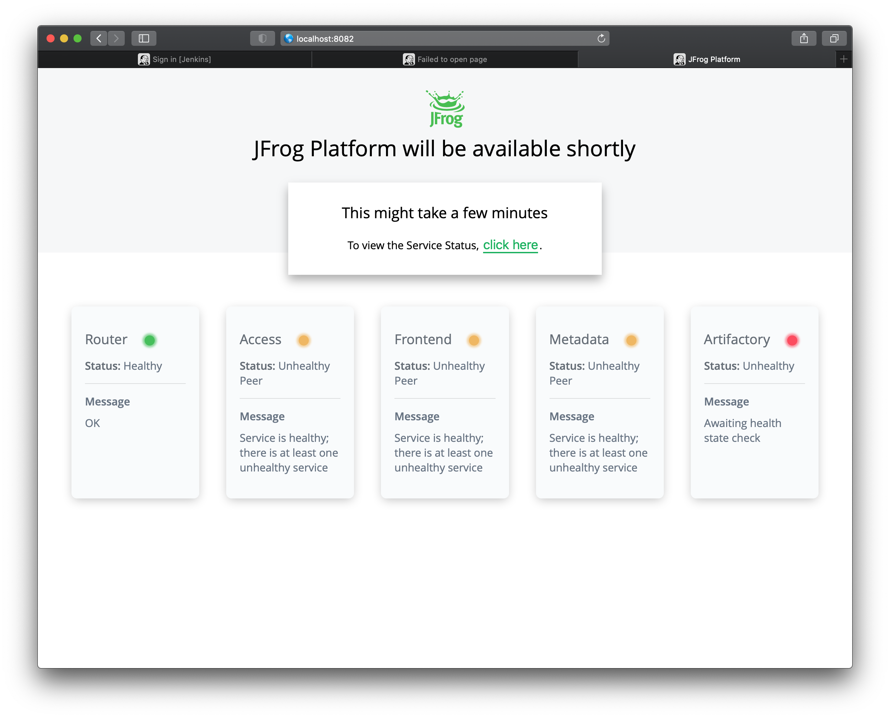
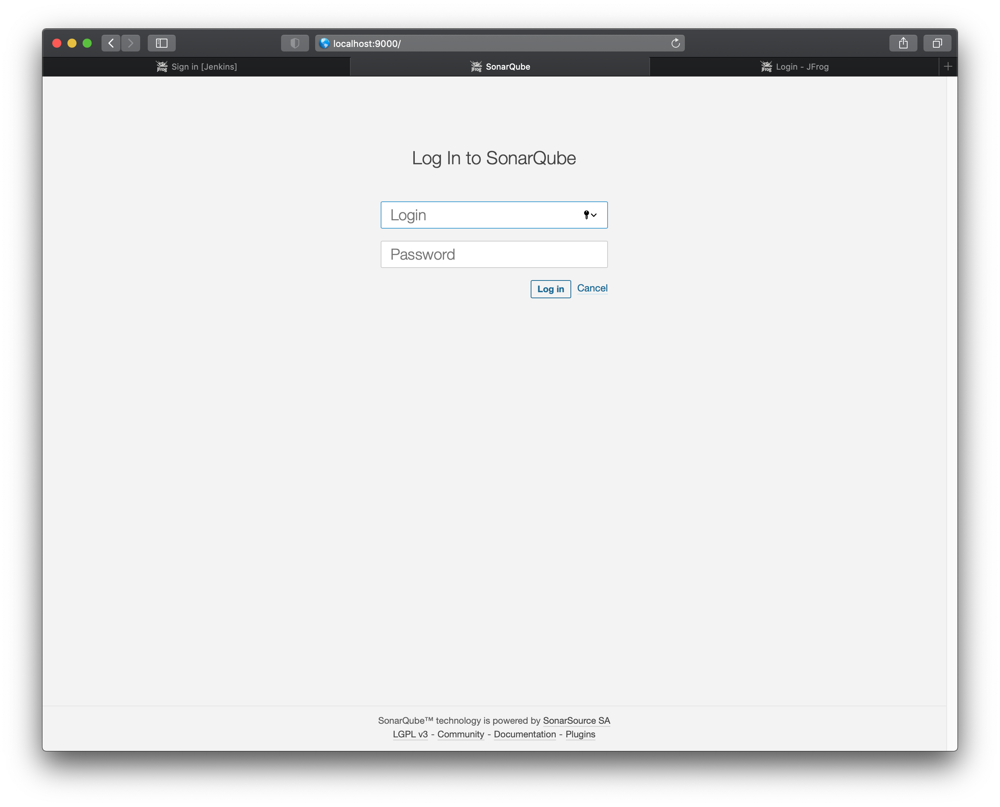

Ed Owen

# ASSIGNMENT 3: Docker - CI Stack in Docker

## docker-compose.yml

    jenkins:
      image: jenkins/jenkins:lts
      ports:
        - 8080:8080
        - 5000:5000
    sonar:
      image: sonarqube:latest
      ports:
        - 9000:9000
      environment:
        SONAR_ES_BOOTSTRAP_CHECKS_DISABLE: 'true'
    rt:
      image: releases-docker.jfrog.io/jfrog/artifactory-oss:latest
      ports:
        - 8081:8081 
        - 8082:8082
      volumes:
        - /Users/devops/artifactory/jfrog-artifactory-oss-6.23.3/artifactory/var/:/var/opt/jfrog/artifactory

## docker-compose up -d

    devops@MacBook-Pro:~/devops/repos/ucsc-devops-03|main⚡ ⇒  docker-compose up -d
    Creating network "ucsc-devops-03_default" with the default driver
    Pulling jenkins (jenkins/jenkins:lts)...
    lts: Pulling from jenkins/jenkins
    0ecb575e629c: Pull complete
    a87482283dbb: Pull complete
    2840288a4396: Pull complete
    7babd9b3a647: Pull complete
    32fca1975e69: Pull complete
    e312a5ba8f8e: Pull complete
    272b18e55eca: Pull complete
    f50793502d95: Pull complete
    cc4412b6fab1: Pull complete
    c872c8c9f426: Pull complete
    19bd584ba415: Pull complete
    bd0781ebc26d: Pull complete
    0192ff499d4d: Pull complete
    c81ed22746ad: Pull complete
    f3fd1d16f5e2: Pull complete
    ea1ea136eccc: Pull complete
    Digest: sha256:3647dc7dcf43faf20a612465dc1aed6bf510893ff9724df4050604af80123b85
    Status: Downloaded newer image for jenkins/jenkins:lts
    Pulling sonar (sonarqube:latest)...
    latest: Pulling from library/sonarqube
    f84cab65f19f: Pull complete
    176f5467a5eb: Pull complete
    bc366b10b6f8: Pull complete
    134920072585: Pull complete
    09d707182f3d: Pull complete
    Digest: sha256:afe75f0dc79eef1681924b130febcb644740216f555c1a7cbd892fe192ed1737
    Status: Downloaded newer image for sonarqube:latest
    Pulling rt (releases-docker.jfrog.io/jfrog/artifactory-oss:latest)...
    latest: Pulling from jfrog/artifactory-oss
    22d07936ce3b: Pull complete
    bfd6805b4758: Pull complete
    cd4ca6bce587: Pull complete
    dec1786f4e7f: Pull complete
    75b7a0260a17: Pull complete
    efa9d3f9b38d: Pull complete
    2b9329a7745b: Pull complete
    5ca082303943: Pull complete
    c668459b3a7d: Pull complete
    0f130025eb69: Pull complete
    Digest: sha256:d41fccc77d141e207cc89a6a1e7b992ec64c260f4d1135ef16c15899c037016f
    Status: Downloaded newer image for releases-docker.jfrog.io/jfrog/artifactory-oss:latest
    Creating ucsc-devops-03_jenkins_1 ... done
    Creating ucsc-devops-03_rt_1      ... done
    Creating ucsc-devops-03_sonar_1   ... done
    devops@MacBook-Pro:~/devops/repos/ucsc-devops-03|main⚡ ⇒

## Running Apps

### Jenkins

localhost:8080

### Artifactory

localhost:8082

### Sonarqube

localhost:9000

